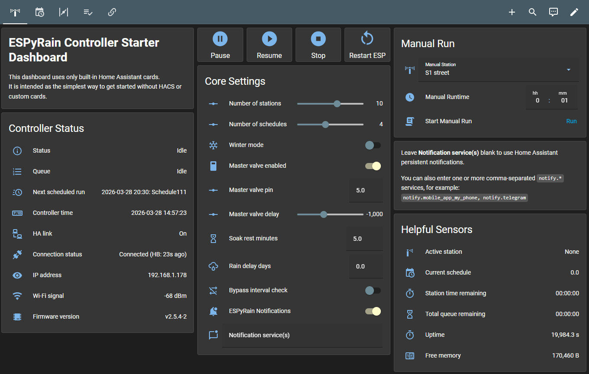
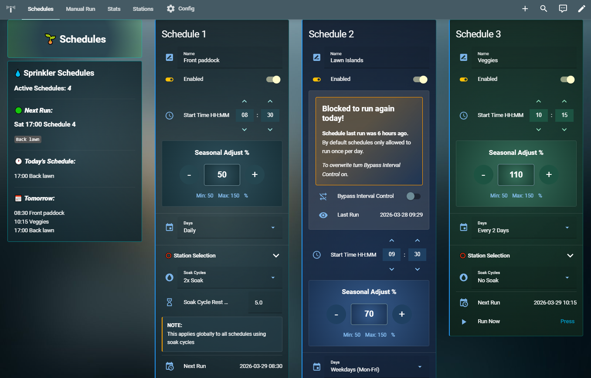

# Dashboard Options

Two HA dashboards are supplied in this folder.

### 1. Starter dashboard with only built-in Home Assistant cards:
It's a simple dashboard to get you started quickly without dependencies or styling.
- [`HA_dashboards/ESPyRain_dashboard_simple.yaml`](ESPyRain_dashboard_simple.yaml)


### 2. Full custom-card dashboard:
Full featured dashboard for a better user experience but requires HACS and custom cards.
- [`HA_dashboards/ESPyRain_dashboard_full.yaml`](ESPyRain_dashboard_full.yaml)


## Starter dashboard notes
- No HACS or custom cards required.
- No image assets required.
- Good for first install, testing, and minimal setups.

## Full dashboard dependencies
This dashboard currently uses these custom cards:
- `button-card`
- `card-mod`
- `fold-entity-row`
- `large-number-input-card` (search for `large-number-input)
- `mini-graph-card`
- `template-entity-row`
- `time-picker-card`

The full dashboard also references built-in wrapper types that appear as custom-prefixed entries in YAML:
- `custom:hui-conditional-card`
- `custom:hui-markdown-card`

Those are HA frontend wrappers, not external HACS dependencies.

## Required image assets for the full dashboard
The full dashboard currently expects these files under HA `www/espyrain/`:
- `/local/espyrain/espyrain_background.jpg`
- `/local/espyrain/your_property_overhead.jpg`

```
`-- www/
    `-- espyrain/
        |-- espyrain_background.jpg
        `-- your_property_overhead.jpg
```

For best result use the supplied ESPyRain Theme. Make sure you copy ESPyRain Theme into your themes folder and restarted HA.

Replace your_property_overhead.jpg with your own image and move the buttons in the dashboard card to match your valve layout by adjusting top and left %:

```
style:
   top: 90%
   left: 85%
```   

If those assets are missing, either:
- add files with those exact paths, or
- edit [`HA_dashboards/ESPyRain_dashboard_full.yaml`](ESPyRain_dashboard_full.yaml) to point to your own images

## Installation
For step-by-step installation see [INSTALL_CHECKLIST.md](../INSTALL_CHECKLIST.md).


