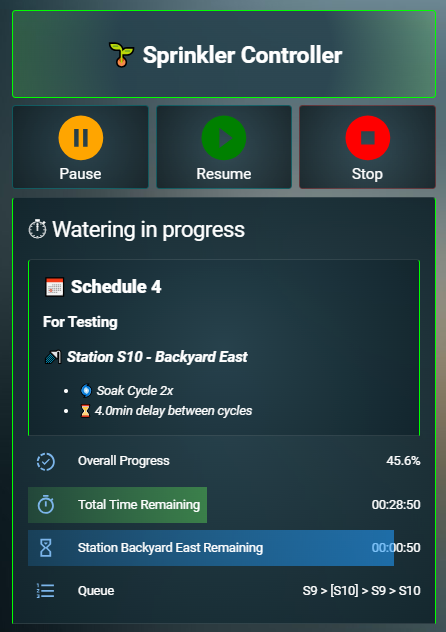

# ESPHome Sprinkler Controller for Home Assistant

An ESP32-based sprinkler controller with deep Home Assistant integration, designed to keep running scheduled irrigation autonomously once configured.

This project combines the flexibility and visibility of Home Assistant with local execution on the ESP32, so scheduled watering can continue even if Home Assistant or Wi-Fi is temporarily unavailable.

It is built for users who want a powerful, transparent, highly configurable irrigation system without depending on a cloud service or a closed commercial controller.

## What This Project Is

This system provides a full-featured sprinkler controller built with:

- `ESPHome` on an `ESP32` for local irrigation execution
- `Home Assistant` for configuration, dashboard control, notifications, and higher-level logic

The key design goal is reliability:

- schedules run locally on the controller
- overlapping runs are queued instead of being skipped
- manual runs and scheduled runs can coexist
- Home Assistant enhances the system, but is not required for scheduled watering once setup is complete

## Key Features

### Core Irrigation Control

- Up to `8` schedules
- Up to `16` stations
- Manual station runs
- Manual runtime selection
- Queue-based execution
- Overlapping runs are added to the queue instead of being skipped
- Support for scheduled runs and manual runs in the same system

### Advanced Irrigation Logic

- Soak cycles
- Configurable soak rest time
- Seasonal adjust per schedule
- Daily, selected-day, and interval-based schedules
- Coupled stations / linked stations
- Rain delay
- Winter mode
- Optional automatic winter mode using start/end dates

### Reliability and Autonomy

- Scheduled watering continues on the ESP32 even if Home Assistant is unavailable
- Scheduled watering continues if Wi-Fi is unavailable
- State restore across controller restarts
- Heartbeat/disconnect awareness between HA and the controller
- Controller-side queue execution
- No cloud dependency

### Home Assistant Integration

- Home Assistant package-based installation
- Dashboard included
- Companion app control through Home Assistant
- Telegram / notification support
- Forecast and next-run sensors
- Debug sensors and troubleshooting helpers
- Manual run image-map/dashboard support

### Hardware Integration

- Pump / master valve switching
- Pump / valve delay handling
- Suitable for systems that need staged startup or safe changeover timing

## Why This Project Exists

Many irrigation solutions are either:

- easy to use but closed and limited
- powerful but dependent on cloud services
- integrated into Home Assistant but not designed for autonomous operation

This project aims to combine the best parts of both worlds:

- local, reliable execution on the controller
- rich control and visibility through Home Assistant
- transparent logic that can be understood, modified, and extended

## How It Works

The architecture is split between two layers:

### ESP32 / ESPHome Layer

The ESP32 is the actual sprinkler controller. It is responsible for:

- storing schedule execution state
- running stations
- managing the queue
- handling soak cycles
- preserving autonomous scheduled operation

This is what allows the system to keep watering on schedule even if Home Assistant or Wi-Fi is offline.

### Home Assistant Layer

Home Assistant provides:

- configuration helpers
- dashboards
- manual controls
- notifications
- forecast and summary sensors
- optional higher-level automation

Home Assistant is the management and visibility layer, but not the only thing keeping irrigation alive.

## Practical Features That Matter in Daily Use

### Proper Pause Function

This system includes a real pause function for active watering.

Examples where this is useful:

- friends are over for a BBQ
- the lawn maintenance person arrives
- a car is parked on the lawn
- kids are playing on the grass
- you need to quickly stop watering without losing the run state

The goal is to pause cleanly and resume properly, instead of cancelling a run or forcing the user to rebuild it manually.

### Queueing Instead of Skipping

If one schedule is already active and another schedule becomes due, the new run is added to the end of the queue.

This is an important reliability feature. The system is designed so irrigation runs are not silently skipped just because something else is already watering.

### Coupled Stations

If multiple valves need to operate together, they can be linked.

Selecting or starting any station in a linked group can resolve to the whole group, so coupled irrigation zones behave consistently in both manual and scheduled operation.

### Seasonal Adjust

Each schedule supports seasonal adjustment.

This is useful on its own, but it also makes weather-based runtime adjustment easy to add for users who have reliable local weather or rainfall data in Home Assistant.

Rather than building one fixed weather model into the controller, this project lets advanced users drive `Seasonal Adjust` through HA automations if they want that behavior.

## Pump / Master Valve Support

This project supports pump or master valve switching, including delay handling.

This is useful for installations where:

- a pump must start before station valves open
- a pump or master valve should remain active briefly during station changeover
- valve/pump timing needs to be coordinated safely

Note: pump / master valve behavior should always be validated for each hardware installation before relying on it in production.

## Control Options

You can control the system through:

- the Home Assistant dashboard
- the Home Assistant companion app
- Home Assistant automations
- ESPHome button/services exposed to Home Assistant

Manual watering can be started either from standard controls or from a mapped image-based station selection card.

## Who This Project Is For

This project is a good fit if you:

- want a local-first irrigation controller
- already use Home Assistant and ESPHome
- are comfortable editing YAML
- want more flexibility than a fixed commercial controller usually provides
- care about autonomy, visibility, and reliability

It is probably not the best fit if you want a completely one-click beginner install with no YAML editing.

## Requirements

### Software

- Home Assistant
- ESPHome
- Required Lovelace custom cards for the included dashboard

### Hardware

- ESP32
- Relay board or suitable sprinkler output hardware
- Optional pump or master valve output
- Optional Telegram notifier for notifications

### Expected User Skill Level

This project is best suited for users who are comfortable with:

- editing YAML
- Home Assistant configuration
- ESPHome configuration
- basic irrigation wiring concepts

It is packaged to be easier to install, but it is still designed for advanced Home Assistant users rather than one-click beginners.

## Quick Start

Detailed setup steps are documented in:

- `INSTALL_CHECKLIST.md`

At a high level, installation looks like this:

1. Install the Home Assistant package
2. Add required secrets
3. Install required Lovelace custom cards
4. Prepare the ESPHome wrapper config
5. Configure Wi-Fi, API, OTA, and hardware-specific settings
6. Flash the ESP32
7. Import or add the dashboard
8. Configure stations, schedules, and optional features
9. Run first manual and scheduled tests

## First-Time Setup Checklist

After the package is installed, the first things most users will want to configure are:

- station names
- station enabled states
- GPIO / valve mapping
- schedule names
- schedule times and day modes
- soak cycle options
- soak rest time
- seasonal adjust values
- coupled stations if used
- notification settings
- winter mode dates if used
- dashboard image paths if using the manual run map

## Repository Layout

- `ESP_sprinkler-controller/`
  - ESPHome package, wrapper examples, and controller firmware configuration

- `packages/`
  - Home Assistant package entrypoint

- `package_sources/`
  - Home Assistant package source files:
  - helpers
  - automations
  - scripts
  - sensors
  - templates

- `HA_dashboard/`
  - dashboard YAML and dashboard dependency notes

- `INSTALL_CHECKLIST.md`
  - detailed installation and setup checklist

- `VERSION`
  - canonical project version

## Dashboard and Companion App

The included dashboard is designed to expose the controller in a practical, operator-friendly way.

It includes:

- schedule configuration
- watering progress
- runtime stats
- manual run controls
- controller status and debug information
- optional image-based station start buttons

Because the system is exposed through Home Assistant, it can also be controlled through the Home Assistant companion app.

## Current Scope

This project already includes:

- autonomous scheduled irrigation execution on the ESP
- Home Assistant integration
- soak cycles
- queue-based overlap handling
- seasonal adjust
- rain delay
- winter mode
- notifications
- dashboard control
- manual image-map station control

## Notes on Weather-Based Watering

Weather-based runtime adjustment is not forced into the project as a built-in one-size-fits-all feature.

This is intentional.

Weather data quality varies a lot by location, and some users have much more reliable local weather information than others. For users with good local data in Home Assistant, runtime adjustment can be added very easily by automating schedule `Seasonal Adjust`.

This gives flexibility without forcing unreliable forecast assumptions on every installation.

## Roadmap / Future Ideas

Potential future improvements include:

- optional weather/rain-based skip logic
- further public package polish
- installation simplification
- additional diagnostics and onboarding improvements
- optional flow/leak monitoring if supporting hardware is added

## Status

This project is actively being refined and packaged for cleaner public installation.

The goal is a reliable, transparent, local-first irrigation controller that can be adapted to different properties and watering needs.

## License

To be added.
