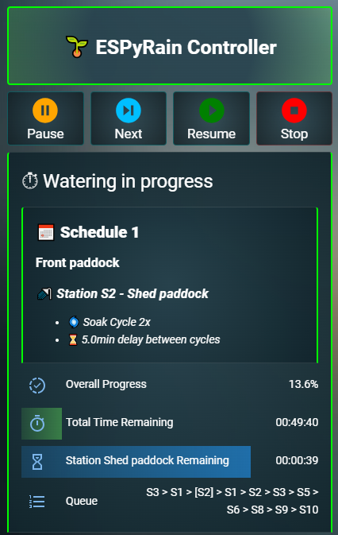
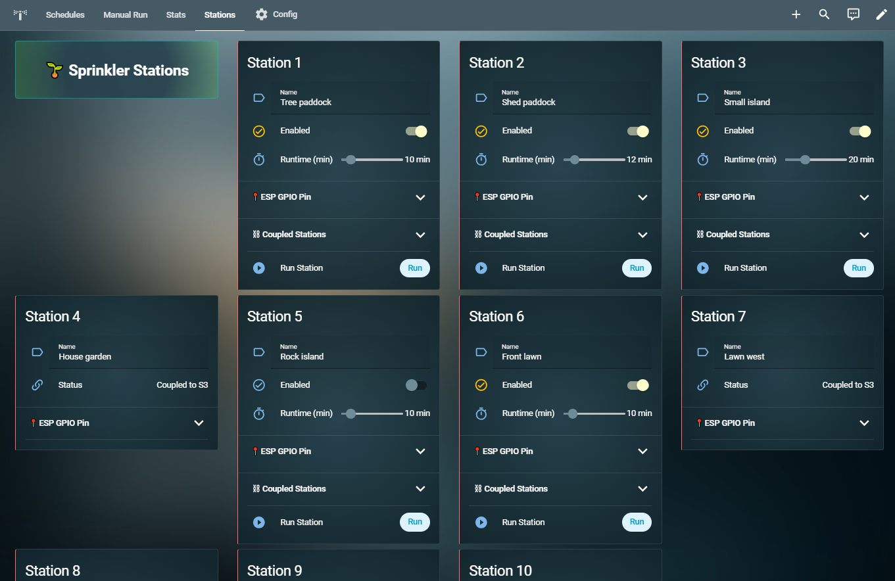
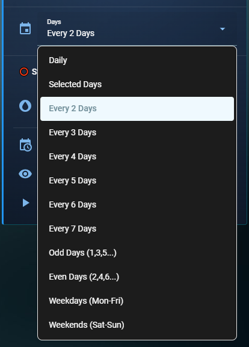
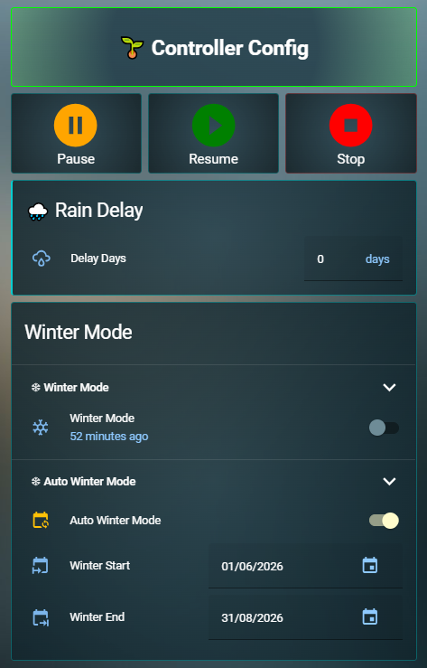
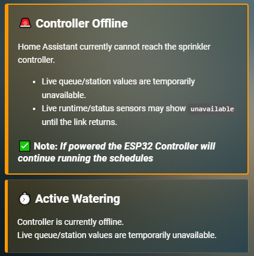
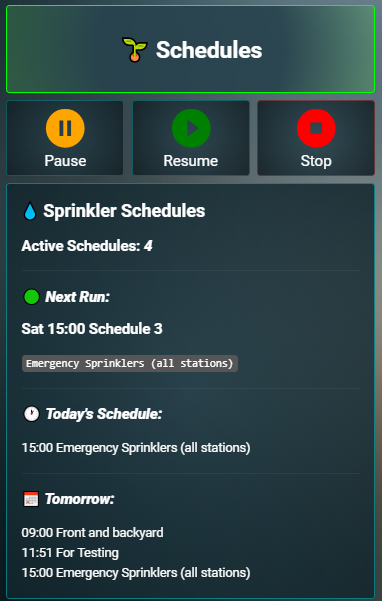
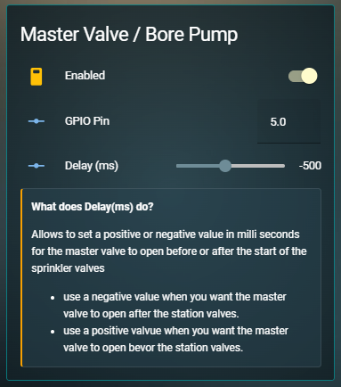
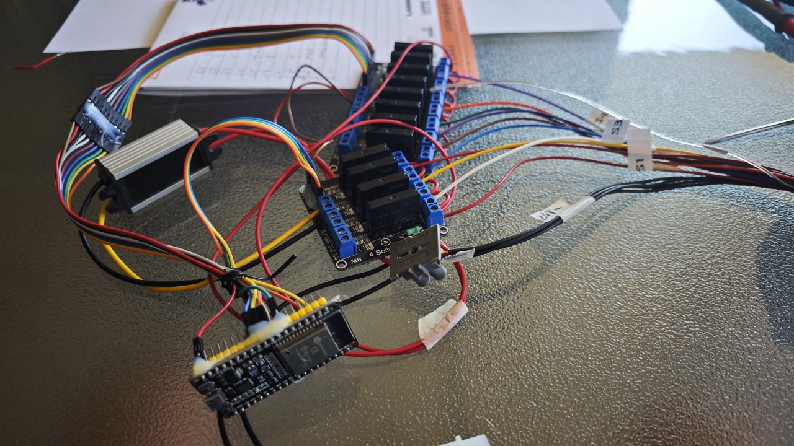

# ESPyRain Sprinkler Controller for Home Assistant

An ESP32-based sprinkler controller with Home Assistant integration. It was designed with two main goals in mind:
- to be fully configurable through Home Assistant, no yaml reload, no HA restart, no ESP reflash needed after the initial installation.
- to keep scheduled irrigation running autonomously even if Home Assistant or Wi-Fi is temporarily unavailable.

ESPyRain is built for users who want a powerful, transparent, highly configurable irrigation system without depending on a cloud service or a closed commercial controller.

There is already a wide selection of ESP-based sprinkler systems available. More common solutions like ESPHome Sprinkler Controller and Irrigation Unlimited are both capable and reliable, but they usually require recompiling and reflashing the ESP32 when you want to make changes to the controller itself.

The aim of ESPyRain is different. The goal is to avoid reflashing or reloading YAML files for everyday changes. Users should be able to set and control everything through Home Assistant, so even a partner or family member can change a schedule start time or a station runtime without editing YAML files, reloading Home Assistant, or recompiling and reflashing the ESP.

ESPyRain Controller gives users full control of their watering requirements through Home Assistant without needing to restart Home Assistant or reflash the ESP after the initial setup.

Another important design goal is autonomy. The ESP32 continues scheduled watering even if Home Assistant or Wi-Fi is temporarily unavailable. ESPyRain stores all schedules directly on the ESP device to allow fully autonomous watering.

## What Is ESPyRain Controller?

ESPyRain provides a full-featured sprinkler controller built with:

- `ESPHome` on an `ESP32` for local irrigation execution
- `Home Assistant` for configuration, dashboard control, notifications, and higher-level logic

The key design goals are reliability and usability:

- schedules run locally on the controller
- overlapping runs are queued instead of being skipped or cancelled
- manual and scheduled runs can coexist
- the queue runs on a first-in, first-out basis
- Home Assistant enhances the system, but is not required for scheduled watering once the initial setup is complete

## Key Features

### Configuration

Easy configuration through the HA dashboard. You can configure all major aspects directly through Home Assistant. No further YAML editing, YAML reloading, or ESP flashing is required to change a GPIO pin, add a schedule or update a station runtime.

ESPyRain does not use programs like many regular controllers. Instead, it uses schedules where the user selects stations and start times.

ESPyRain configuration options from HA without restarting HA or reflashing the ESP32 include:

- set the number of required stations/zones from `1` to `16` (hardware permitting)
- set the number of required schedules from `1` to `8`
- set the master valve / pump GPIO pin
- set master valve / pump delay-start timer
- set the station/zone GPIO pins
- name your stations/zones
- enable or disable stations/zones
- set individual station runtimes
- select coupled stations to work together
- name your schedules
- enable or disable schedules
- set schedule start times
- set seasonal adjust percentage per schedule
- choose schedule day mode, odd/even, every 2 to 7 days, selected days, weekends, or weekdays
- set soak cycles
- set soak delay between cycles
- set auto resume timer
- set rain delay
- set winter mode
- set automatic winter mode
- enable or disable notifications
- bypass interval check

Note: using the day mode `Every 2x Days` has the advantage that your sprinklers will not water on two consecutive days or miss watering days at the end of a month, as can happen with `Odd/Even`.

### Core Irrigation Control

- bore pump / master valve support
- up to `16` stations
- up to `8` schedules
- seasonal adjust runtimes from `50%` to `150%`
- manual station runs
- manual per-station runtime selection
- queue-based execution
- overlapping runs are added to the queue without interrupting the current run
- support for scheduled runs and manual runs in the same system

### Advanced Irrigation Logic

- pause and resume at any time
- soak cycles `2x` to `5x`
- configurable soak rest time
- seasonal adjust per schedule
- daily, selected-day, and interval-based schedules
- coupled stations / linked stations
- rain delay
- winter mode
- optional automatic winter mode using start and end dates
- optional automatic resume after pause with `0` = disabled
- hard queue cap of `100` total station items to prevent uncontrolled queue growth

### Reliability and Autonomy

- scheduled watering continues on the ESP32 even if Home Assistant is unavailable
- scheduled watering continues if Wi-Fi is unavailable
- state restore across controller restarts
- heartbeat / disconnect awareness between HA and the controller
- controller-side queue execution
- no cloud dependency

### Home Assistant Integration

- Home Assistant package-based installation
- dashboard YAML included
- HA Companion app control through Home Assistant
- flexible notification support
- forecast and next-run sensors
- basic diagnostic and troubleshooting sensors
- manual run image-map dashboard support
- runtime stats through custom cards on the full dashboard

### Hardware Integration

- pump / master valve switching
- pump / valve delay handling
- solenoid valve switching
- suitable for systems that need staged startup or safe changeover timing

## Why ESPyRain Was Designed

Many irrigation solutions are either:

- easy to use but closed and limited
- powerful but dependent on cloud services
- integrated into Home Assistant but difficult to use
- integrated into Home Assistant but not designed for autonomous operation

ESPyRain aims to combine the best parts of both worlds:

- local, reliable execution on the ESP controller
- rich control and visibility through Home Assistant
- easy day-to-day operation through Home Assistant
- transparent logic that can be understood, modified, and extended

## How It Works

The architecture is split between two layers.

### ESP32 / ESPHome Layer

The ESP32 is the actual sprinkler controller. It is responsible for:

- storing schedule execution state
- running stations
- managing the queue
- handling soak cycles
- preserving autonomous scheduled operation

This is what allows the system to keep watering on schedule even if Home Assistant or Wi-Fi is temporarily offline.

### Home Assistant Layer

Home Assistant provides:

- configuration helpers
- dashboards
- manual controls
- notifications
- forecast and summary sensors
- optional higher-level automation

Home Assistant is the management and visibility layer, but not the only thing keeping irrigation alive.

## Practical Features That Matter in Daily Use

### Real Pause Function

This system includes a real pause function for active watering. The pause feature removes the need to cancel and restart a schedule later just to finish watering.

Pausing can be useful when you quickly need to stop watering without losing the run state.
Examples are:
- sprinkler maintenance while you replace or adjust a sprinkler head
- your kids want to play on the lawn
- you have visitors over for a BBQ
- the lawn maintenance person arrives
- you need to divert pump pressure to fill up a water tank
- a car is parked on the front lawn which you need to move first
- you want to do gardening without getting wet

The goal is to pause cleanly and resume properly, instead of cancelling a run. This can save water because you do not need to restart the whole schedule from the beginning.

ESPyRain also supports an optional automatic resume timer. If a run stays paused longer than the configured value, the controller resumes automatically. Setting `0` disables automatic resume and lets the system stay paused indefinitely until resume is pressed.

### Queueing Instead of Cancelling or Skipping

If one schedule is already active and another schedule becomes due, the new run is added to the end of the queue. This can happen when two schedules were originally programmed to run one after another, but seasonal adjust causes them to overlap.

This is an important reliability feature. The system is designed so irrigation runs are not silently cancelled or skipped just because something else is already watering.

To stop the queue from growing without limit during long pauses or heavy overlap, ESPyRain enforces a hard cap of 100 total queued station items. Manual additions and scheduled runs that would exceed that limit are rejected, and users can be notified when that happens.

### Coupled Stations

If multiple valves need to operate together, they can be linked.

Selecting or starting any station in a linked group can resolve to the whole group, so coupled irrigation zones behave consistently in both manual and scheduled operation.

### Seasonal Adjust %

Each schedule supports individual seasonal adjustment between `50%` and `150%`.

This is useful on its own, but it also makes weather-based runtime adjustment easy to add for users who have reliable local weather or rainfall data in Home Assistant and want to use that data to adjust runtimes automatically.

Rather than building one fixed weather model into the controller, this project lets advanced users drive `Seasonal Adjust %` per schedule through HA automations if they want that behavior.

## Pump / Master Valve Support

This project supports pump or master valve switching, including start delay timer handling.

This is useful for installations where:

- a pump must start before or after station valves open
- a pump or master valve should remain active during station changeover
- valve/pump timing needs to be coordinated safely

Note: pump / master valve behavior should always be validated for each hardware installation before relying on it in production.

## Control Options

You can control the system through:

- the Home Assistant dashboard
- the Home Assistant companion app
- the built-in webserver for when Home Assistant is down
- Home Assistant automations
- ESPHome buttons and services exposed to Home Assistant
- Since everything is controlled through HA there is no need to add the complexity of a monitor and buttons. 

Manual watering can be started either from standard controls or from a mapped image-based station selection card.

## Who This Project Is For

This project is a good fit if you:

- want an easy-to-use feature rich sprinkler controller
- want a local-first irrigation controller
- already use Home Assistant and ESPHome
- are comfortable editing YAML
- want more flexibility than a typical fixed commercial controller provides
- need more than 8 stations/zones
- care about autonomy, visibility, and reliability

## Requirements

### Software

- Home Assistant
- ESPHome
- optional Lovelace custom cards for the full dashboard
- HACS to install custom-cards

### Hardware

- ESP32 board
- relay board or suitable sprinkler output hardware
- optional pump or master valve output
- optional Home Assistant `notify.*` services for notifications

### Expected User Skill Level

This project is best suited for users who are comfortable with:

- editing YAML
- Home Assistant configuration
- ESPHome configuration
- basic irrigation wiring concepts

It is packaged to be easier to install. It should be straightforward for advanced Home Assistant users, and less experienced users can follow the step-by-step [INSTALL_CHECKLIST.md](INSTALL_CHECKLIST.md).

## Quick Start

Detailed setup steps are documented in:

- [INSTALL_CHECKLIST.md](INSTALL_CHECKLIST.md)

At a high level, installation looks like this:

1. Copy the package files into Home Assistant
2. Create a temporary ESPHome device to harvest the API key and board settings
3. Prepare [`ESPyRain-controller/espyrain_controller_wrapper.yaml`](ESPyRain-controller/espyrain_controller_wrapper.yaml) and `/config/esphome/secrets.yaml`
4. Compile and flash the ESP32
5. Add the newly discovered ESPyRain device in Home Assistant
6. Enable Home Assistant package loading in `configuration.yaml`
7. Restart Home Assistant and confirm the helpers appear
8. Import the simple dashboard first, or the full dashboard if you already installed its dependencies
9. Configure stations, schedules, coupling, and notification settings
10. Run the first manual and scheduled tests

## Notifications

Notifications work out of the box without Telegram or any other third-party service.

Default behavior:
- if notifications are enabled and no custom service is configured, ESPyRain creates a Home Assistant persistent notification

Optional custom targets:
- set `input_text.espyrain_notify_service` to one `notify.*` target
- or enter multiple comma-separated `notify.*` targets
- this can easily be done in the dashboard at `Notification Service(s)`

Examples:
- `notify.mobile_app_my_phone`
- `notify.telegram_bot_123456789_987654321, notify.mobile_app_my_phone`

## First-Time Setup Checklist

After installation, the first things most users will want to configure are:

- station names
- station enabled states
- GPIO / valve mapping
- schedule names
- schedule times and day modes
- soak cycle options
- soak rest time
- seasonal adjust values
- coupled stations if used
- notification settings
- winter mode dates if used
- dashboard image paths if using the full dashboard manual-run image map

## Repository Layout

- [`ESPyRain-controller/`](ESPyRain-controller/) 
  - ESPHome package, wrapper examples, and controller firmware configuration

- [`HA_dashboards/`](HA_dashboards/)
  - dashboard YAML files and dashboard dependency notes

- [`packages/`](packages/)
  - Home Assistant package entrypoint

- [`package_sources/`](package_sources/)
  - Home Assistant package source files for helpers, automations, scripts, sensors, and templates

- [`INSTALL_CHECKLIST.md`](INSTALL_CHECKLIST.md)
  - detailed installation and setup checklist

- [`VERSION`](ESPyRain-controller/VERSION)
  - canonical project version

## Dashboard and Companion App

The included dashboards are designed to expose the controller in a practical, operator-friendly way.

The simple dashboard is intended for:
- easy onboarding
- built-in cards only
- no HACS requirement

The full dashboard is intended for:
- richer visuals
- custom cards
- advanced presentation and image-based controls

Because the system is exposed through Home Assistant, it can also be controlled through the Home Assistant companion app on your mobile.

## Current Scope

This project already includes:

- autonomous scheduled irrigation execution on the ESP
- Home Assistant integration
- soak cycles
- queue-based overlap handling
- seasonal adjust
- rain delay
- winter mode
- notifications
- dashboard control
- manual image-map station control

## Notes on Weather-Based Watering

Weather-based runtime adjustment is not forced into the project as a built-in one-size-fits-all feature.

This is intentional.

Weather data quality varies a lot by location, and some users have much more reliable local weather information than others. For users with good local data in Home Assistant, runtime adjustment can be added very easily by automating schedule `Seasonal Adjust`.

This gives flexibility without forcing unreliable forecast assumptions on every installation.

## Roadmap / Future Ideas

Potential future improvements include:

- optional weather/rain-based skip logic
- further public package polish
- installation simplification
- additional diagnostics and onboarding improvements
- optional flow/leak monitoring if supporting hardware is added

## Status

This project is actively being refined and packaged for cleaner public installation.

The goal is a reliable, transparent, local-first irrigation controller that can be adapted to different properties and watering needs.

## License

This project is licensed under the Apache License 2.0. See [`LICENSE`](LICENSE).

## Branding

The code is licensed under Apache 2.0, but the `ESPyRain` name, branding, and presentation assets are not granted for reuse beyond what the license and applicable law allow. If you create a derivative project, please use your own name and branding.

## Thank you
Special thanks to Robert, the creator of Irrigation Unlimited where I pinched a few ideas from and also ESPHome Sprinkler.

## Installation
For step-by-step installation see [INSTALL_CHECKLIST.md](INSTALL_CHECKLIST.md).

